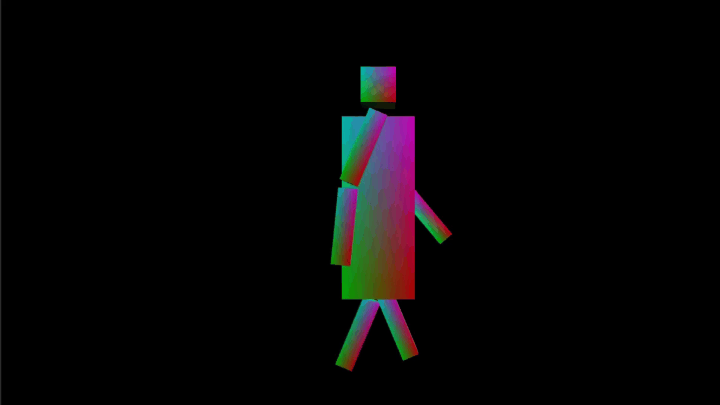
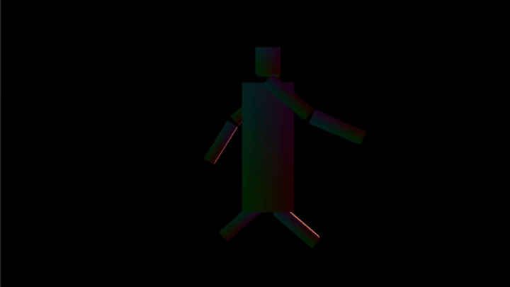
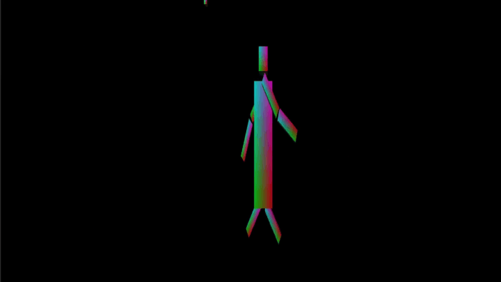

# OpenGL Roboter-Animation

Dieses Projekt ist eine kleine 3D-Anwendung in C++ mit OpenGL.
Es zeigt eine einfache humanoide Figur aus Würfeln, die animiert wird.

## Demo

### Laufanimation



### Rechts-/Links-Bewegung



### Zoom In/Out



## Was das Programm macht

- Zeichnet eine 3D-Roboterfigur aus mehreren Würfeln (Kopf, Rumpf, Arme, Beine).
- Animiert Arme und Beine in einer Laufbewegung.
- Nutzt Beleuchtung mit Ambient, Diffuse und Specular (Phong-Modell).
- Bewegt eine Punktlichtquelle im Kreis um die Figur.

## Steuerung

- `Esc`: Programm beenden
- `Pfeil hoch` / `Pfeil runter`: Sichtwinkel (`FOV`) größer/kleiner
- `Pfeil links` / `Pfeil rechts`: Seitenverhältnis (`Aspect Ratio`) kleiner/größer

Hinweis: `W`, `A`, `S`, `D` haben in der aktuellen Version keine Funktion mehr.

## Wichtige Dateien

- `src/AppMain.cpp`
  - Einstiegspunkt des Programms (`main`).
- `src/Game/ApplicationWindow.h/.cpp`
  - Fenster, Hauptschleife und Weitergabe von Eingaben an die Szene.
- `src/Game/RobotAnimationScene.h/.cpp`
  - Szene aufbauen, Animation updaten, Rendern und Licht setzen.
- `src/Game/CubeMeshWithNormals.h`
  - Vertex-Daten des Würfels (Position, Normale, Farbe).
- `assets/shaders/vertex.glsl`
  - Vertex-Shader: Transformation in Welt- und Kameraraum.
- `assets/shaders/fragment.glsl`
  - Fragment-Shader: Beleuchtungsberechnung.
- `framework/*`
  - Hilfscode fuer OpenGL-Fenster, Input und Fehlerausgabe.
- `libs/stb/*`
  - Externe, kleine Bild-Utility-Bibliothek.

## Bauen (CMake)

Abhängigkeiten: OpenGL, GLFW, GLEW, GLM.
`stb` liegt schon im Projekt unter `libs/stb`.

Beispiel:

```powershell
cmake -S . -B build
cmake --build build --config Release
```
